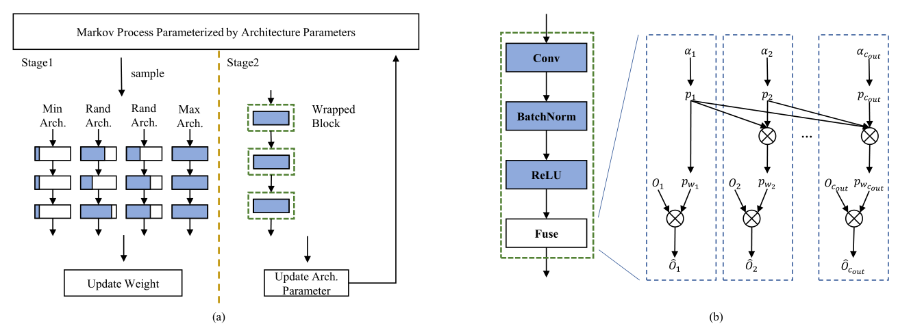

# DMCP: Differentiable Markov Channel Pruning for Neural Networks (CVPR 2020 Oral)

Shaopeng Guo, Yujie Wang, Quanquan Li, and Junjie Yan.

Our paper [Arxiv](https://arxiv.org/abs/2005.03354)

This repository is implemented by Zeren Chen when he is an intern at SenseTime Research.

## Introduction



We proposed a differentiable channel pruning method named Differentiable Markov Channel Pruning (DMCP).
The channel pruning is modeled as the Markov process to eliminate duplicated solutions from the straight forward modeling (e.g. independent Bernoulli variables).
See our paper for more details.

## Requirements

The code is tested with python 3.6, pytorch 1.1 and cuda 9.0. Other requirements can be install via:

    pip install -r requirements.txt
 
## Usage

**Setup up the setting of `dataset.path` in config file first to specify the path to imagenet dataset.**

```bash
python main.py --mode <M> --data <D> --config <C> --flops <F> [--chcfg <H>]

-M, --mode, running mode: train | eval | calc_flops | sample, default: eval.
-D, --data: specify data folder.
-C, --config, specify config file.
-F, --flops, specify target flops.
--chcfg, specify channel config file when retrain pruned model from scratch.
```
 
One example to train mbv2-300m:
 
```bash
# run dmcp process
# result in `results/DMCP_MobileNetV2_43_MMDDHH/`
python main.py --mode train --data path-to-data --config config/mbv2/dmcp.yaml --flops 43

# use above pruned channel config to retrain the model from scratch
# result in `results/Adaptive_MobileNetV2_43_MMDDHH`
python main.py --mode train --data path-to-data --config config/mbv2/retrain.yaml \ 
    --flops 43 --chcfg ./results/DMCPMobileNetV2_43_MMDDHH/model_sample/expected_ch
```

## Pretrained models

We provide pretrained models, including

* dmcp-stage1 checkpoint (e.g. stage1/res18-stage1.pth)

* dmcp-stage2 checkpoint (pruned model after dmcp process, e.g. res18-1.04g/checkpoints/pruned.pth)

* retrained models (e.g. res18-1.04g/checkpoints/retrain.pth)

You can download it from [release]() and change the `recovery` setting in config file.

### Results

**Note: The original implementation is based on the internal version of sync batchnorm. We use torch.nn.BatchNorm2d in this release.
So the accuracy may have some fluctuations compared with the report of the paper.**

<table>
    <tr>
        <th>model</th>
        <th>target flops</th>
        <th>top 1</th>
    </tr>
    <tr>
        <td rowspan=6>mobilenet-v2</td>
        <td>43M</td>
        <td>59.0</td>
    </tr>
    <tr>
        <td>59M</td>
        <td>62.4</td>
    </tr>
    <tr>
        <td>87M</td>
        <td>66.2</td>
    </tr>
    <tr>
        <td>97M</td>
        <td>67.0</td>
    </tr>
    <tr>
        <td>211M</td>
        <td>71.6</td>
    </tr>
    <tr>
        <td>300M</td>
        <td>73.5</td>
    </tr>
    <tr>
        <td rowspan=1>resnet-18</td>
        <td>1.04G</td>
        <td>69.0</td>
    </tr>
    <tr>
        <td rowspan=4>resnet-50</td>
        <td>279M</td>
        <td>68.3</td>
    </tr>
    <tr>
        <td>1.1G</td>
        <td>74.1</td>
    </tr>
    <tr>
        <td>2.2G</td>
        <td>76.5</td>
    </tr>
    <tr>
        <td>2.8G</td>
        <td>76.6</td>
    </tr>
</table>

## Citation

If you find DMCP useful in your research, please consider citing:

    @inproceedings{guo2020dmcp,
    title     = {DMCP: Differentiable Markov Channel Pruning for Neural Networks},
    author    = {Shaopeng, Guo and Yujie, Wang and Quanquan, Li and Junjie Yan},
    booktitle = {IEEE Conference on Computer Vision and Pattern Recognition (CVPR)},
    year      = {2020},
    }

## License

The usage of this software is under [CC-BY-4.0](LICENSE).

## Acknowledgement

We thank Yujing Shen for his exploration at the beginning of this project.
